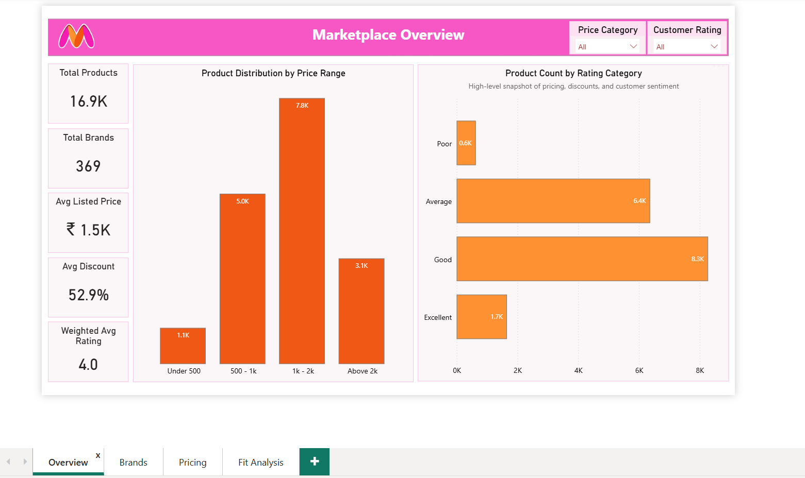
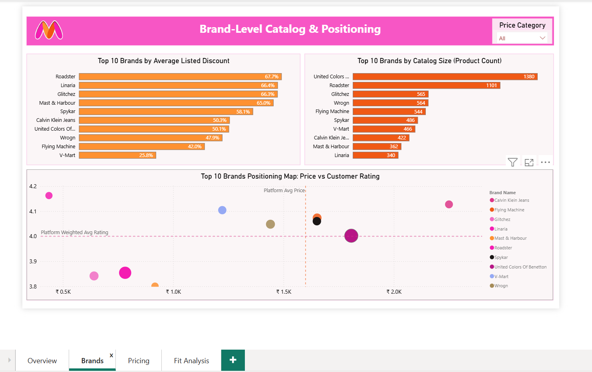
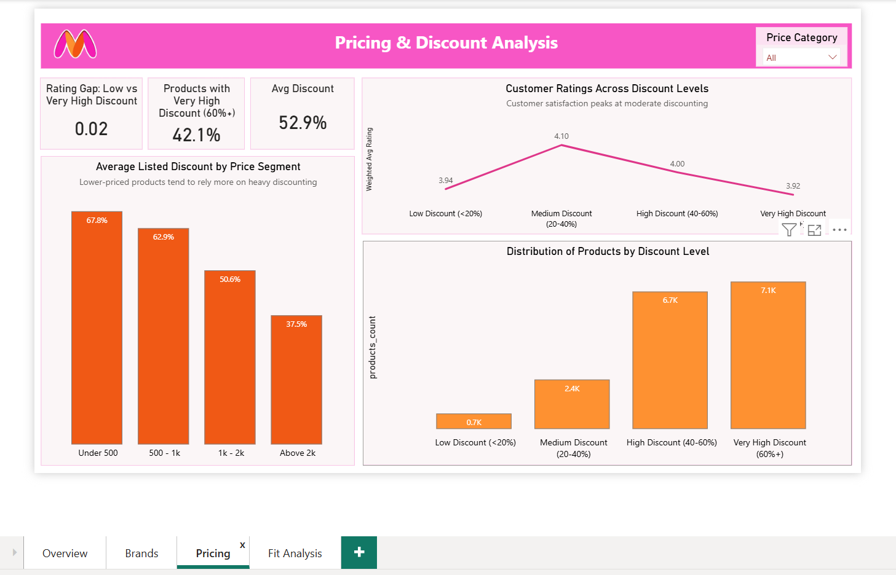
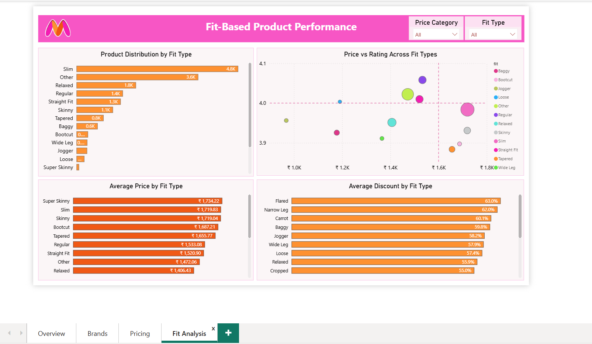

# Myntra Product & Marketplace Analysis  
**Excel + Power BI Capstone Project**

## Project Overview

This project analyzes Myntra’s product catalog using a cleaned, structured dataset built from scraped product listings.  
The objective is to understand **how the marketplace is structured** in terms of pricing, discounting, brand presence, product attributes, and customer ratings.
The analysis focuses on **catalog behavior and positioning**.

## What This Analysis Explores

The dashboards are designed to answer questions such as:

- How is the product catalog distributed across different price ranges?
- How are products spread across customer rating categories?
- Which brands dominate the catalog by size and discounting strategy?
- Does heavy discounting lead to better customer ratings?
- How do price, discount, and ratings vary across product fit types?

## Dataset Summary

- **Source:** Scraped Myntra product listings (public product metadata)
- **Size:** ~52,000 raw product records
- **Final Analytical Dataset:** ~16,900 cleaned products
## Data Cleaning & Preparation (Excel)

Excel was used as the first stage of analysis to clean, standardise, and prepare the data for BI consumption.

Key steps included:
- Removing duplicate and invalid product records  
- Converting price, MRP, ratings, and review counts to numeric formats  
- Recalculating discount percentage using a consistent formula  
- Standardising brand names  
- Extracting product attributes (fit, fabric, wash type) from descriptions  
- Handling missing and inconsistent values  
- Creating analytical buckets:
  - Price ranges  
  - Rating categories  

## Power BI Dashboard Structure

### 1️⃣ Marketplace Overview

**Purpose:** Provide a high-level snapshot of the marketplace.

This page shows:
- Total number of products and brands
- Average listed price and average discount
- Weighted average customer rating
- Distribution of products across:
  - Price ranges
  - Rating categories

### 2️⃣ Brand-Level Catalog & Positioning

**Purpose:** Understand how brands compete within the marketplace.

This page analyzes:
- Top brands by catalog size (product count)
- Top brands by average listed discount
- Brand positioning using:
  - Average price
  - Weighted average rating
  - Product count (bubble size)

### 3️⃣ Pricing & Discount Behavior

**Purpose:** Examine how discounting relates to pricing and customer ratings.

This page explores:
- Average discount across price segments
- Distribution of products by discount level
- Customer ratings across discount buckets
- Rating difference between low-discount and very-high-discount products

### 4️⃣ Fit-Based Product Performance

**Purpose:** Analyse product performance across different fit types.

This page covers:
- Distribution of products by fit type
- Average price by fit
- Average discount by fit
- Price vs rating comparison across fits

## Key Observations from the Analysis

- The catalog is concentrated in mid-price ranges rather than extremes
- Most products fall into the “Good” and “Average” rating categories
- A small number of brands contribute a large share of total listings
- Heavy discounting is common, but does not consistently improve ratings
- Moderate discount levels are associated with slightly higher customer ratings
- Higher-priced products do not always receive higher ratings
- Certain fit types are priced more premium but still rely on discounts

## Assumptions & Limitations

- No sales, revenue, or quantity data is available
- Ratings are treated as post-purchase customer sentiment
- Discounts analysed are listed discounts, not realised transaction discounts
- Product attributes are extracted from free-text descriptions and may contain inaccuracies
- The dataset represents a static snapshot, not time-based trends

## Tools Used

- **Excel:** Data cleaning, transformation, EDA, Power query
- **Power BI:** Data modelling, DAX measures, interactive dashboards

> **Disclaimer**  
> This project is for learning and portfolio demonstration purposes only and does not represent internal Myntra business data.
